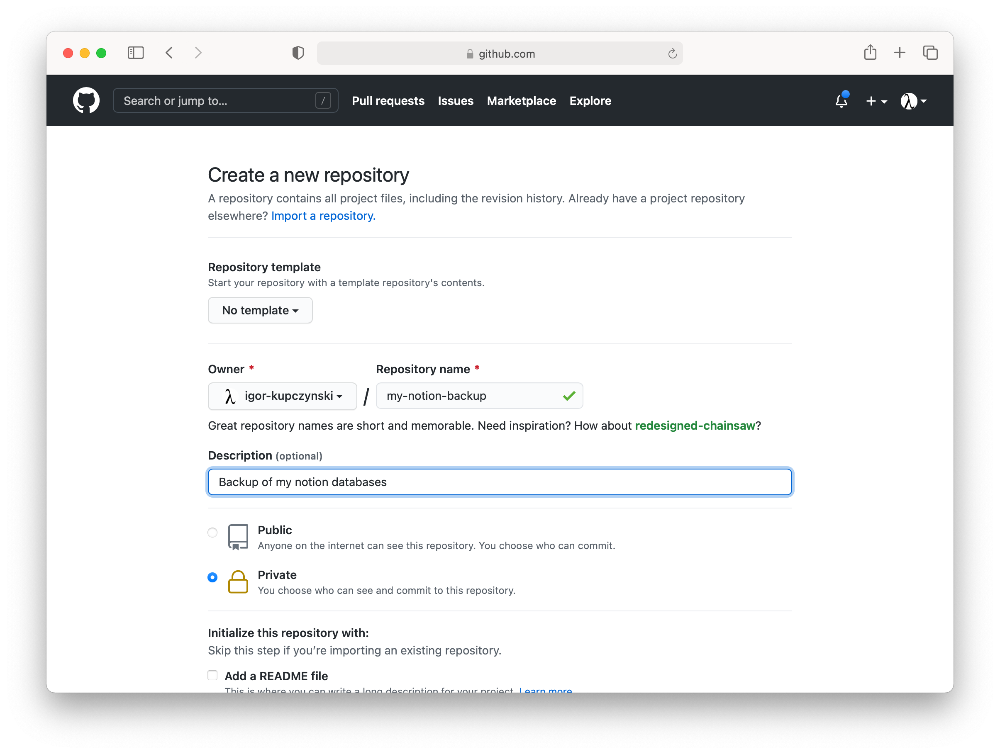
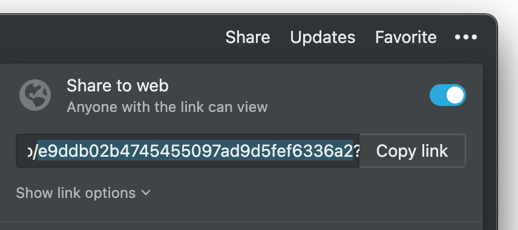
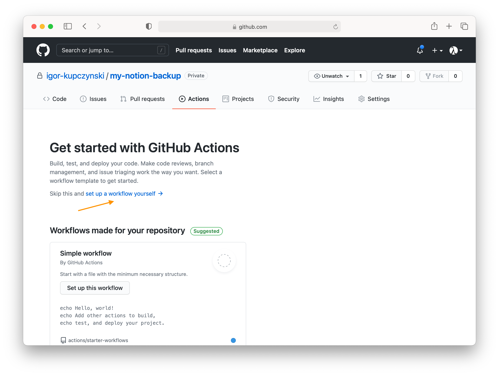
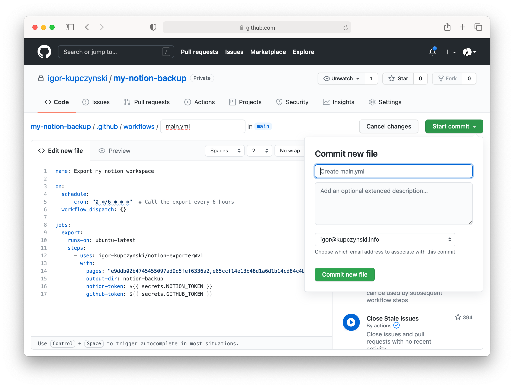
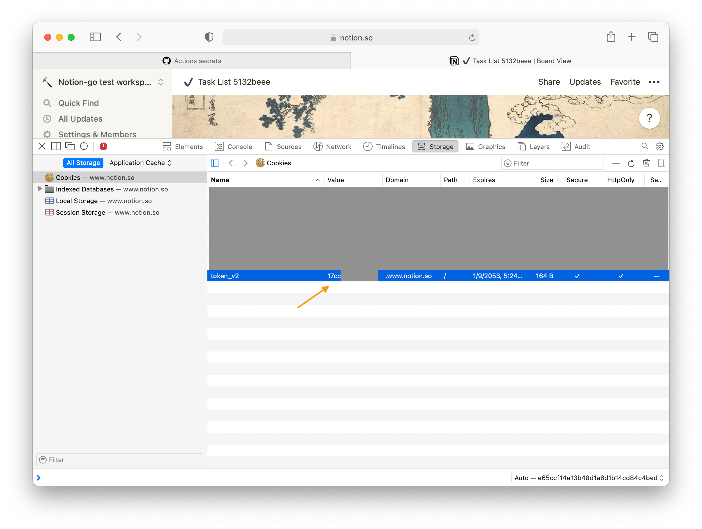
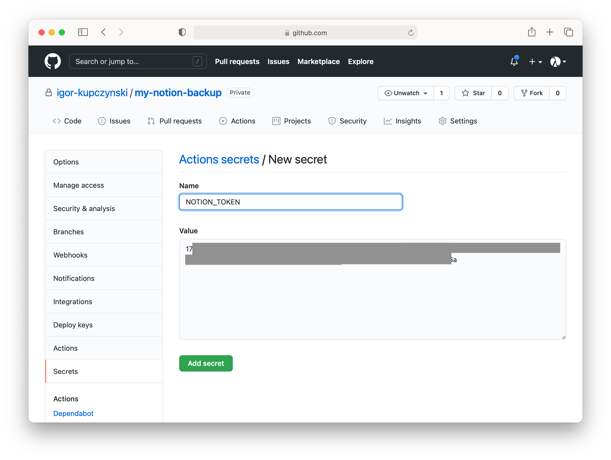
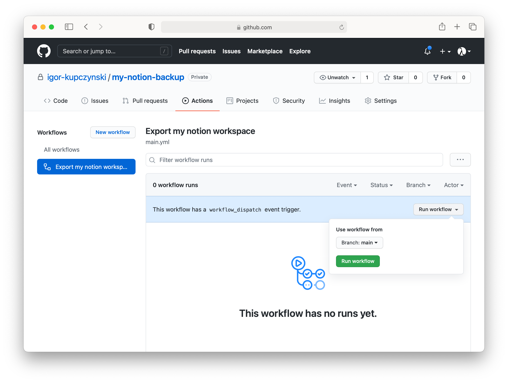
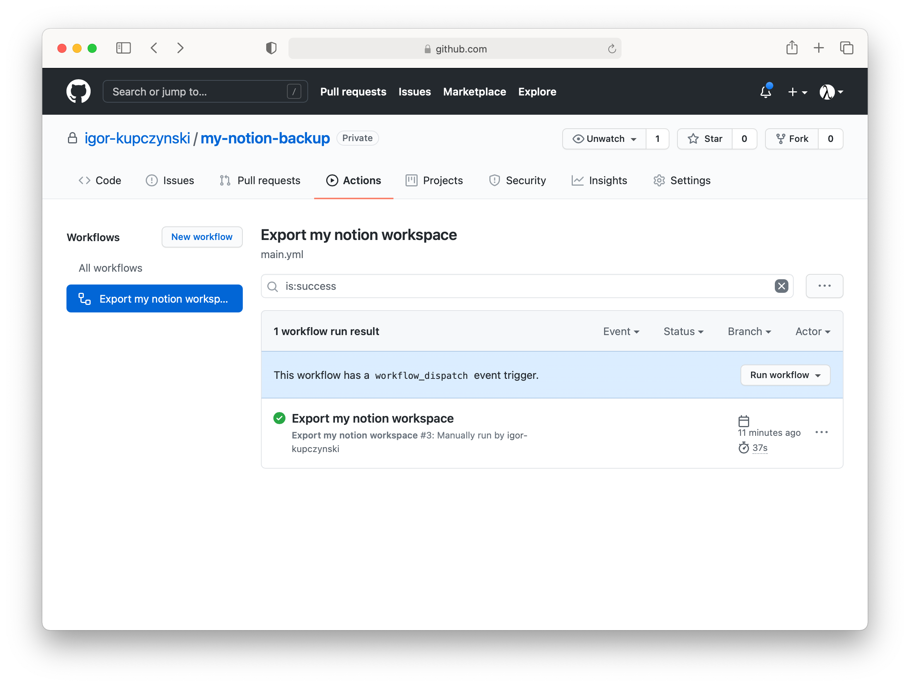
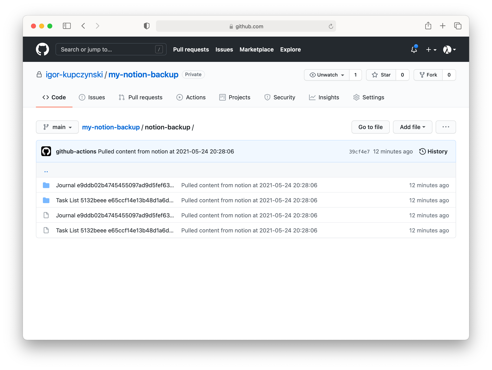

**UPDATE 2022-02-13**: No longer maintained, as I don't use notion anymore. Sorry for the inconvience.


# notion-exporter

Notion Exporter is a github action which allows you to export the content of your Notion ([notion.so](https://notion.so)) pages and databases as markdown, to a github repo.

Both the target repo and the source workspace can be private. The Github free plan is good enough 🙏. The action uses the internal Notion API.

## Demo

See [igor-kupczynski/notion-exporter-demo](https://github.com/igor-kupczynski/notion-exporter-demo).

## Usage

### 1. Create a github repo

- Go to https://github.com/new
- Fill the details as needed
- The repo can be private


      
### 2. Find out the root page IDs you want to export

* You need to provide the IDs of the root pages/databases that you want to export. All children will be exported automatically.
* You can get the page IDs from the **Share** menu in Notion.
* Say the web link is `https://www.notion.so/e9ddb02b4745455097ad9d5fef6336a2?v=530e3734d3ef461c76fcc349e28b7b7a`, then your page ID is `e9ddb02b4745455097ad9d5fef6336a2`.
* You don't need to share the pages.
* Provide all the page IDs separated by a comma, e.g. `e9ddb02b4745455097ad9d5fef6336a2,e65ccf14e13b48d1a6d1b14cd84c4bed`



### 3. Add a new workflow

* Go to **Actions** tab and click **Setup the workflow yourself**.


  
* Paste the following code 
  
    * Use your own page IDs in `pages`
    * Change `0/6` to how often you want to trigger the export. `0/6` means every 6 hours, `0/24` means every 24 hours.
```yaml
name: Export my notion workspace

on:
  schedule:
    - cron: "0 */6 * * *"  # Call the export every 6 hours
  workflow_dispatch: {}

jobs:
  export:
    runs-on: ubuntu-latest
    steps:
      - uses: igor-kupczynski/notion-exporter@v1.0.2
        with:
          pages: "e9ddb02b4745455097ad9d5fef6336a2,e65ccf14e13b48d1a6d1b14cd84c4bed"  # Pages IDs identified in (step 2)  
          output-dir: notion-backup
          notion-token: ${{ secrets.NOTION_TOKEN }}
          github-token: ${{ secrets.GITHUB_TOKEN }}
```
    


* Click **Start commit**

* Click **Commit new file**



## 4. Grab the notion token

* We can't use the notion API unauthenticated. The export feature is not yet part of the public API (in beta), so we need to use the internal API.
* We need the value of the `token_v2` cookie.
* You can grab it from your web browser. E.g. in chrome:
    1. Log-in to notion and go to your workspace.
    2. Open developer tools: **Menu** --> **More Tools** -> **Developer Tools**
    3. Go to **Application** tab
    4. Go tp **Storage** -> **Cookies**
    5. Copy the value of `token_v2` cookie

(Screenshot from safari)



## 5. Setup the token as a secret

* Go to **Settings** tab, then **Secretes** and add a new secret.

8 Use `NOTION_TOKEN` as **Name**.

* Paste the `token_v2` as the **Value**.




## 6. Trigger the export manually

* Test if the export works by manually triggering it.

* Go to **Actions** tab, then select **Export my notion workspace** on the left-hand side.

* Then select **Run workflow** and again **Run workflow**.



* In a minute or so you should see a successful run.



* Note the next runs should start automatically as per the schedule you've set up.

* Check the `notion-backup` folder for the content.




## How does it work?

The action relies on the [notion export feature](https://www.notion.so/Export-a-page-as-Markdown-69b6031dd9454022abed8e23a86b0e1e). To call it programmatically we rely on the unofficial [notion API go client](https://www.notion.so/Export-a-page-as-Markdown-69b6031dd9454022abed8e23a86b0e1e).

## Inputs

### `pages`

Comma-separated list of page to export the data from. Pages are exported recursively, including their children.

E.g. `e9ddb02b4745455097ad9d5fef6336a2,e65ccf14e13b48d1a6d1b14cd84c4bed`.

### `github-token`

Github token to use to commit to the repo. Most of the time we can pass the default github action token:
```yaml
github-token: ${{ secrets.GITHUB_TOKEN }}
```
  
### `notion-token`

Value of the `token_v2` cookie.

### `output-dir`

Directory under your repo to sync the data to.

🔥🔥🔥 Note the existing content of the directory will be deleted, use with care.

In the demo we set it to [`notion-backup`](https://github.com/igor-kupczynski/notion-exporter-demo/tree/main/notion-backup).

### (optional) `force-branch`

By default, the action discovers the branch to commit to from the `GITHUB_REF` var, but you can override it with `force-branch` input.
